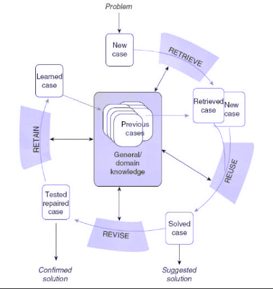

```{r setup, include=FALSE}
knitr::opts_knit$set(root.dir = '../') 
knitr::opts_chunk$set(echo = TRUE)
source("dutch/R/01_libraries.R")
source("dutch/R/02_functions.R")
data <- read_training_data()

query_data <- data %>%
  slice(1)

query_data[1, 2] <- 15
query_data[1, 5] <- 1
query_data[1, 6] <- 23
query_data[1, 9] <- 3

query_data <- query_data %>%
  mutate(sentence = "") # sentence has to be empty, because the model will predict this value
```

In deze blog leg ik kort uit hoe je in R een case-based reasoning (cbr) systeem kan bouwen. Eerst ga ik kort in op wat cbr is, uit welke fases een CBR-model bestaat en wat de voor- en nadelen van CBR zijn. Vervolgens leg ik uit hoe in R, op basis van de sentence dataset, een simpel cbr-model gebouwd kan worden.

**Resources voor de blog**

* Shinyapp: Ik heb ook een Shiny-app ontwikkeld, welke de output van het CBR-model weergeeft. Deze Shinyapp is te vinden via onderstaande link: https://sietske97.shinyapps.io/casebased-reasoning-application
* Repository met code: De code voor deze repository is ook op GitHub te vinden via onderstaande URL: https://github.com/sietske97/casebased-reasoning-application

# Wat is case-based reasoning? 
Case-based reasoning is een machine learning methode die een nieuw probleem oplost, op basis van oplossingen van gelijksoortige problemen uit het verleden. Data is in een CBR-systeem altijd gerepresenteerd in een probleem-oplossing vorm: er is een probleem waarvoor een oplossing gevonden moet worden. De oplossing voor het nieuwe probleem kan gevonden worden door in de CBR-database te zoeken naar oude, soortgelijke problemen. De oplossing van dit gelijksoortig oude probleem kan vervolgens toegepast worden op het nieuwe probleem. Dit kan het nieuwe probleem oplossen. 

# De CBR-cyclus
Een CBR-systeem bestaat uit vier verschillende fases: the retrieve, reuse, revise and retain fases. Deze vier fasen vormen de CBR-cyclus. Door deze stappen te doorlopen kan een nieuwe oplossing aangedragen worden voor een nieuw probleem. De vier verschillende fases worden hieronder kort omschreven. De CBR-cyclus is te zien op de volgende afbeelding: : 




#### 1. Retrieve fase
De CBR-cyclus start met een nieuw probleem, the 'current problem'. Vervolgens zoekt het systeem in de case base, waarin alle oude casussen staan, naar soortgelijke casussen. Dit gebeurt met een algoritme dat de 'distance' en 'similarity' tussen de nieuwe en oude casus berekent. Verschillende algoritmes kunnen hiervoor gebruikt worden, maar in het ontwikkelde prototype wordt een KNN-algortime gebruikt. Vervolgens worden de meest gelijke casussen weergegeven aan de gebruiker. 

#### 2. Reuse fase
Op basis van de 'retrieved case' wordt een oplossing voor de nieuwe casus aangedragen. Dit kan op verschillende manieren gedaan worden. De meest simpele methode is door de oplossing van de 'retrieved case' direct toe te passen op de 'new case'. Het is echter ook mogelijk dat een CBR-systeem niet één maar meerdere gelijke casussen retrieved. In dit geval kan door middel van een telling vastgesteld worden welke oplossing het vaakst voorkomt en kan deze oplossing toegepast worden op de nieuwe casus. Echter kunnen ook regels ingebouwd worden, om in bepaalde situaties bepaalde oplossingen aan te dragen. Deze opties zijn echter afhankelijk van het domein van het CBR-prototype en de beschikbare data. De aangedragen oplossing wordt vervolgens, buiten het systeem, toegepast op de nieuwe casus. 

#### 3. Revision fase
Deze fase in een CBR-systeem is optioneel. Nadat de oplossing is toegepast op de nieuwe casus wordt duidelijk of de oplossing werkt of niet. Als de oplossing niet heeft gewerkt kan de nieuwe case opnieuw de CBR-cyclus doorlopen en kan het CBR-systeem een nieuwe oplossing aandragen. Deze nieuwe oplossing wordt vervolgens weer toegepast op de casus. Het is afhankelijk van de contet van het CBR-systeem of deze fase daadwerkelijk plaatsvindt. 
This step is optional in a CBR system. After the solution has been applied to the new case, it becomes clear over time whether the solution works. In the event that the solution did not work, the case can go through the CBR cycle again. The CBR system can then provide a revised solution for the failed case. This can then be applied to the case outside the system. Whether this step actually takes place depends on the context of the CBR system.

#### 4. Retain fase
Als laatste stap in het CBR-systeem kan de nieuwe casus, met de bijbehorende oplossing, toegevoegd worden aan de case base. Dit gebeurt alleen als dit waarde oplevert voor het systeem. Als de nieuwe casus toegevoegd wordt, kan deze casus in de toekomst wanneer er voor nieuwe casussen een oplossing gevonden moet worden, gebruikt worden om een oplossing aan te dragen. Daarnaast kan het CBR-systeem leren van het feit of de oplossing wel of niet succesvol was. OP deze manier leert een CBR-systeem van zijn eigen advies. Het is echter wel belangrijk dat het CBR-systeem niet zijn eigen bias creëert door zijn eigen oplossing te blijven aandragen. In hoeverre dit gebeurt is afhankelijk van het CBR-systeem. 

CBR wordt in erg veel verschillende domeinen toegepast, van helpdesken tot de diagnose van ziektes. Het is een methode die voor zowel klassificatie als regressieproblemen gebruikt kan worden. Bij klassificatie voorspelt het model een klasse en bij regressie voorspelt het modl een nummer. Een voorbeeld van een klassificatieprobleem is het identificeren van spammail. Het CBR-model voorspelt het label: spam of geen spam. Een voorbeeld van regressie is het voorspellen van de omzet van een bedrijf. 

# Voordelen en nadelen van CBR
CBR is wezenlijk anders dan andere methodes die ‘solutions’ kunnen aandragen voor nieuwe
problemen, omdat CBR uitgaat van redenering op basis van een of meerdere casussen in de casebase, tegengesteld aan generalistische patronen die in de database te vinden zijn. In deze
hoedanigheid zijn ook enkele voordelen te noemen aan het gebruik van CBR. Tevens zijn er ook
enkele nadelen te noemen aan het gebruik van een CBR-systeem. De belangrijkste voor- en
nadelen worden hieronder kort toegelicht.

#### Voordelen van CBR
1. Een CBR-systeem is intuïtiever dan andere algoritmes. Dit maakt de werking van een CBR-
systeem eenvoudiger te begrijpen. De gebruiker van het systeem ziet namelijk niet alleen
maar een aangedragen oplossing, maar ook de oude casussen in de case base waarop deze
oplossing gebaseerd is. Deze werking lijkt veel meer op menselijke probleemoplossing dan
een model dat enkel een output geeft.
2. Oplossingen die het CBR-model aandraagt worden gerechtvaardigd door precedent. De
oplossingen zijn al een keer in de echt wereld toegepast. Hoewel dit een andere casus
betrof baseert het CBR-systeem zich op oplossingen die al een keer toegepast zijn. Hierbij
is wel belangrijk om te weten of de oplossing van de oude casussen geslaagd was.
3. Het CBR-systeem kan leren van slechte oplossingen. Als bekend is of de oplossingen van
de casussen in de case base succesvol waren of niet, kan het systeem de werking van de
oplossing meenemen in het aandragen van een oplossing voor de nieuwe casus.
4. CBR kan door de flexibele toepassing en representatie van de werkelijkheid in een
probleem-oplossing definitie toegepast worden in heel veel verschillende domeinen.

#### Nadelen van CBR
1. Een CBR-systeem heeft alleen maar waarde als het in staat is om tijdens de ‘retrieval’ fase
relevante casussen uit te case base te selecteren. Er zijn veel soorten distance
measurements die hiervoor gebruikt kunnen worden. Aangezien de effectiviteit van een
CBR-systeem afhankelijk is van de nauwkeurigheid van de retrieval fase moet er genoeg
kennis zijn over verschillende soorten distance measurements en hun werking.
2. Het aanpassen van de oude oplossing, zodat deze werkzaam is voor het nieuwe probleem,
tijdens de ‘reuse’ fase kan lastig zijn. Hoe en of de oplossing wordt aangepast is
contextafhankelijk, maar in complexe domeinen zal de oude oplossing niet 1 op 1
overgenomen kunnen worden voor het nieuwe probleem. In deze gevallen zal er in het
CBR-systeem zelf regels ingebouwd moeten worden om de oplossing voor de nieuwe casus
aan te passen.
3. Alle oude casussen moeten worden opgeslagen in de case base. Bij andere methodes wordt
een model getraind op een trainset, en hoeft vervolgens alleen het model opgeslagen te
worden. Het opslaan van casussen is voor kleine datasets geen probleem, maar wanneer er
miljoenen oude casussen zijn kan dit een obstakel vormen. Een oplossing is om in dit soort gevallen een selectie te maken van oude casussen die representatief zijn voor de gehele
dataset en alleen deze op te slaan in het CBR-systeem.
4. Doordat het CBR-systeem niet getraind wordt, maar pas als de nieuwe casus de CBR-cyclus
doorloopt berekeningen maakt, kan het in het geval van grote datasets langer duren voor
dat het systeem een oplossing aandraagt. Net als het tweede nadeel is dit vooral nadelig
wanneer het CBR-systeem een hele grote dataset heeft.

# Het ontwikkelen van een CBR-systeem in R
Er is op dit moment geen CRAN package waarmee een CBR-systeem in R gebouwd kan worden. In 2019 was er een package genaamd  [CaseBasedReasoning](https://cran.r-project.org/web/packages/CaseBasedReasoning/index.html) maar deze is helaas verwijderd van CRAN in oktober 2019. Daarom moeten verschillende packages in R gecombineerd worden om een CBR-systeem te maken, en moet een deel van de code aangepast worden. 

Het CBR-systeem dat in deze blog wordt uitgelegd maakt gebruik van een KNN-nearest neighbour agoritme om de meest-gelijke casussen te selecteren. Het KNN package dat gebruikt wordt is  [FNN](https://cran.r-project.org/web/packages/FNN/index.html). Dit package bevat code voor een 'Fast Nearest Neighbour Search Algoritm'. Daarnaast bevat de output van het KNN-model ook een index met de meest-gelijke casussen die gebruikt kunnen worden om de gebruiker de meest-gelijke casussen te laten zien. 

Het CBR-systeem maakt gebruikt van een open dataset, de  **cook county dataset** die gedownload kan worden van de [website van de Cook County Government](https://datacatalog.cookcountyil.gov/Courts/Sentencing/tg8v-tm6u).De dataset bevat een groot aantal records van veroordelingen en de bijbehorende straf. De straffen zijn opgedeeld in twee opties: **non-dentention**, zoals een taakstraf, en **detention**, zoals een gevangenisstraf.

**De data en code voor het CBR-model kan gevonden worden in de [case-based reasoning GitHub repository](https://github.com/sietske97/casebased-reasoning-application)**

## De gebruikte packages, dataset en query casus
Hieronder worden de eerste tien rijen van de sentence database weergegeven. De data is op verschillende plekken opgeschoond en er is een steekproef genomen van 5% om ervoor te zorgen dat de webapplicatie niet té langzaam wordt. In de webapplicatie wordt onder de tab 'de gebruikte dataset' uitgelegd op welke manier de originele dataset is opgeschoond. [De dataset kan gedownload worden via de GitHub repository](https://github.com/sietske97/casebased-reasoning-application/tree/master/dutch/data)

```{r head data, echo = TRUE}
# Dit zijn de libraries die gebruikt worden
library(dplyr)
library(readr)
library(recipes)
library(FNN)

# Dit zijn de eerste vijf observaties van de opgeschoonde dataset
head(data, 5)

# Dit is de voorbeeldquery die gebruikt wordt waarvoor de sentence voorspeld gaat worden
head(query_data, 5)
```

## Het CBR Model
Hieronder wordt in zes stappen omschreven hoe er op basis van de Cook County dataset een simpel CBR-model gebouwd is die de eerste twee stappen van de CBR-cyclus doorloopt. 


### 1. Normaliseren van data
Een KNN-algoritme berekent de distance tussen de nieuwe casus en de casussen in de database, en daarom moet de data genormaliseerd worden. Dit moet gebeuren voor zowel de orginele database, als de query casus. Het normaliseren van de database kan eenvoudig met de volgende functie: 

```{r normalize data, echo = TRUE}
# De normalizeringsfunctie
normalize <- function(x) {
  (x - min(x, na.rm = TRUE)) / (max(x, na.rm = TRUE) - min(x, na.rm = TRUE))
}

# pas de functie toe op de dataset
normalized_data <- data %>%
  mutate_if(is.numeric, normalize)

# Het resultaat van de genormaliseerde dataset
head(normalized_data, 5)
```

### 2. Het normaliseren van de query
De query moet ook genormalizeerd worden, maar doet moet gebeuren op basis van de minimale en maximale waarde van de originele dataset. Dit kan op de volgende manier: 
```{r normalize query, echo = TRUE}
data_full <- data %>%
  select(-sentence)

normalized_query <- sapply(names(data_full), function(col) {
  if (is.factor(query_data[[col]])) {
    as.character(query_data[[col]])
  }
  else {
    (query_data[[col]] - min(query_data[[col]])) /
      (max(data_full[[col]]) - min(data_full[[col]]))
  }
})

query_data_normalized <- data_full %>%
  rbind(normalized_query) %>%
  mutate_if(is.character, as.numeric) %>%
  tail(1) %>%
  select(-gender, -case_id) %>%
  mutate(sentence = as.factor(1))
```


### 3. Met behulp van recipe package dummy variabelen maken
Met behulp van de recipes package worden vervolgens dummy variabelen aangemaakt. Daarna wordt dit recipe toegepast op de query data.

```{r bake recipe, echo = TRUE}
# definieer het recept om 'sentence' te voorspellen
recipe <-
  recipe(sentence ~ .,
    data = normalized_data
  ) %>%
  step_dummy(charge_disposition) %>%
  step_dummy(sentence_court_name) %>%
  step_dummy(offense_category) %>%
  step_dummy(convicted_chicago) %>%
  prep()

# Bak met het recept de dataset
data_knn <- recipe %>%
  bake(normalized_data) %>%
  # Dit zijn niet-voorspellende variabelen en moeten dus nog verwijderd worden
  select(-case_id, -gender)
# Bak met het recept de query
data_query <- recipe %>%
  bake(query_data_normalized) %>%
  select(-sentence)
```

### 4. Berekenen van maximale distance tussen twee punten in database
Om de similarity te kunnen berekenen, moet de maximale distance in een dataset berekent worden. De similarity van twee punten in een genormalizeerde dataset is namelijk: 1 - (afstand tussen twee punten / maximale afstand). Dit kan in R met behulp van de volgende code:

```{r maximale distance berkenen}
max_knn_dist <- function(data) {
  no_col <- ncol(data)
  row_nul <- rep(0, no_col)
  row_one <- rep(1, no_col)
  tibble <- as_tibble(row_nul) %>%
    cbind(row_one)
  tibble <- t(tibble)
  test_knn <- tibble
  train_knn <- tibble
  max_dist <- FNN::get.knnx(
    data = train_knn,
    query = test_knn,
    k = 2
  )
  max_dist <- max(max_dist$nn.dist)

  return(max_dist)
}

# Maximale distance van deze dataset
max_dist <- max_knn_dist(data = data)
```

### 5. Fast Nearest Neighbour Search met package FNN
Vervolgens wordt met behulp van het FNN package een nearest neighbour search gedaan. De database heet in deze functie de 'train' en de query data heet de 'test' case. 

```{r knn search, echo = TRUE}
# Verwijder de labels van de database
data_zonder_label <- data_knn %>%
  select(-sentence)

knn_results <- FNN::knn(
  # Train set is de database zonder label
  train = data_zonder_label,
  # Test set is de query case
  test = data_query,
  # Class is de sentence kolom van de dataset
  cl = data$sentence,
  # K is het aantal verglijkbare casussen
  k = 15,
  # Algorithm is de manier waarop KNN zoekt
  algorithm = "brute",
  # PROB laat de probability van de class zien
  prob = TRUE
)
```


### 6. Het CBR-systeem o.b.v. KNN-results
Met de output van het KNN-model kan vervolgens een CBR-systeem gebouwd worden. De FNN::knn() functie geeft als output een distance matrix met de afstand tussen de query-data en de test data. Daarnaast geeft het package een index van de meest-gelijke casussen en de voorspelde class van de query casus met de probability. Hieronder wordt uitgelegd hoe eerst de similarity tussen de query casus en database berekent kan worden o.b.v. de maximale distance die in stap vier is berekend. 
```{r cbr model, echo = TRUE}
# Sla de verschillende attributes van knn_results apart op
knn_attributes <- attributes(knn_results)

# Bereken de similarity op basis van de distance
# knn_attributes$nn.dist is de afstand tussen de query data en de test data
distance_knn <- t(knn_attributes$nn.dist)

# Deel de distance door de max_distance
similarity_knn <- as_tibble(1 - (distance_knn / max_dist))
```

Vervolgens wordt er aan de query_data drie kolommen toegevoegd: een similarity kolom, een sentence kolom voor de solution en een soort kolom ('query' of 'train_set').

```{r sentence toevoegen, echo = FALSE}
# kolom similarity, sentence en soort toevoegen om te kunnen samenvoegen met resultaten
query_results <- query_data %>%
  mutate(
    similarity = NA,
    sentence = NA,
    soort = "query"
  )
```

Vervolgens moet de genormalizeerde database vervangen worden met de niet-genormalizeerde data, omdat de gebruiker de niet-genormalizeerde data nodig heeft. Dit is simpel de eerder gedefineerde data. Vervolgens wordt op basis van de index_knn de meest-gelijke casussen weergegeven aan de gebruiker. Hierbij zijn de kolommen 'soort' en 'similarity' toegevoegd. Similarity bevat de gelijkenis tussen de twee zaken in percentage. 

```{r cbr_results, echo = TRUE}
# Opslaan van de index_tabel
index_knn <- as_tibble(t(knn_attributes$nn.index))

# Selecteer het juiste element uit de index_knn en similarity_knn tabel
index <- index_knn[[1]]
similarity <- similarity_knn[[1]]
```

De index vector bevat de indexnummers van de casussen in de database die het meest gelijk zijn, en de similarity vector bevat de overeenkomst tussen de query casus en de casus uit de database in percentages. 

```{r distance and similarity vector, echo = TRUE}
# Zo zien de index en distance variabele eruit
print(index)
print(similarity)
```

Vervolgens worden de CBR-resultaten, met de niet-genormalizeerde data, toegevoegd aan een dataframe.

```{r cbr_resultaten dataframe, echo = TRUE}
# Maak een dataframe met daarin de CBR-resultaten  o.b.v. de niet-genormalizeerde data
results_dataframe <- data %>%
  # selecteren van de index
  slice(index) %>% #
  # similarity kolom toevoegen
  cbind(similarity = similarity) %>%
  # Voeg 'soort' kolom toe zodat duidelijk is wat de query en train set is
  mutate(soort = "train_set") %>%
  # Voeg de resultaten van de query toe
  rbind(query_results) %>%
  # Sorteer op 'soort' zodat query als eerste te zien is
  arrange(soort) %>%
  # Laat 'soort' als eerste variabelen zien, daarna similarity en sentence. Vervolgens gender.
  relocate(soort, similarity, sentence, gender)

# Selecteer de oplossing van het model
class_query <- levels(knn_results)

# Output de resultaten in een lijst, genaamd 'results'
results <- list(
  "results_dataframe" = results_dataframe,
  "class" = class_query,
  "probability" = knn_attributes$prob
)
```

De results list bevat een results_dataframe met hierin een visuele weergave van de meest-gelijke casussen van de query casus, de oplossing van deze zaken en een similarity percentage. Het 'class' element is een vector met de aangedragen oplossing, en de 'probability' is het percentage nearest-neighbours dat deze class heeft. Dit percentage is altijd minimaal 50%. De resultaten zien er als volgt uit:

```{r results cbr, echo = TRUE}
# Dit is het dataframe met de resultaten
print(results$results_dataframe)

# Dit is de aangedragen solution door het CBR model
print(results$class)

# Dit is het percentage van de nearest neighbours die de solution aandraagt
print(results$probability)
```

Zoals te zien is in de resultaten is de aangedragen oplossing voor de query casus **detention** omdat 73% van de nearest-neighbours deze klasse had. 

Naast deze code heb ik een simpele Shiny-applicatie ontwikkeld die deze resultaten weergeeft. [De Shiny-applicatie is hier te vinden](https://sietske97.shinyapps.io/casebased-reasoning-application)

### Extra functionaliteit: random query generator
Het CBR-model heeft een 'new case' nodig om te runnen. Deze casus kan handmatig aangemaakt worden of door een gebruiker aangemaakt worden, maar in R kan ook een random query gegenereerd worden. De onderstaande code genereert automatisch een nieuwe casus, gebasseerd op de minimale en maximale waarden van een bestaande dataset.

```{r generate random query, echo = TRUE}
# Definieer vectors waar minimale en maximale waarde in opgeslagen kunnen worden
min_value <- NULL
max_value <- NULL
levels <- NULL
random_level <- NULL
value <- NULL

# For loop die voor elke numerieke kolom de minimale en maximale waarde selecteert en voor categorische variabelen de levels
for (i in 1:ncol(data)) {
  if (!(is.numeric(data[[i]]))) {
    min_value[[i]] <- NA
    max_value[[i]] <- NA
    levels[[i]] <- levels(data[[i]])
  } else {
    min_value[[i]] <- min(data[[i]])
    max_value[[i]] <- max(data[[i]])
    levels[[i]] <- levels(data[[i]])
  }
}

# for loop die voor elke categorische variabele een random level selecteert en voor elke numerieke waarde een random waarde tussen de min en max value.
for (i in 1:ncol(data)) {
  if (is.na(min_value[i])) {
    all_level <- levels[[i]]
    random_level[[i]] <- sample(all_level, 1)
  } else {
    a <- c(min_value[[i]], max_value[[i]])
    random_level[[i]] <- sample(a, 1)
  }
}

# de query data wordt samengevoegd met de gehele database om de verschillende levels van categorische variabelen goed in te stelle. Vervolgens wordt alleen de query casus geselecteerd.
query_data <- data %>%
  rbind(random_level) %>%
  tail(1) %>%
  mutate_if(is.character, as.numeric) %>% 
  mutate(sentence = "")

# Dit is de random-gegenereerde query
head(query_data, 1)
```
